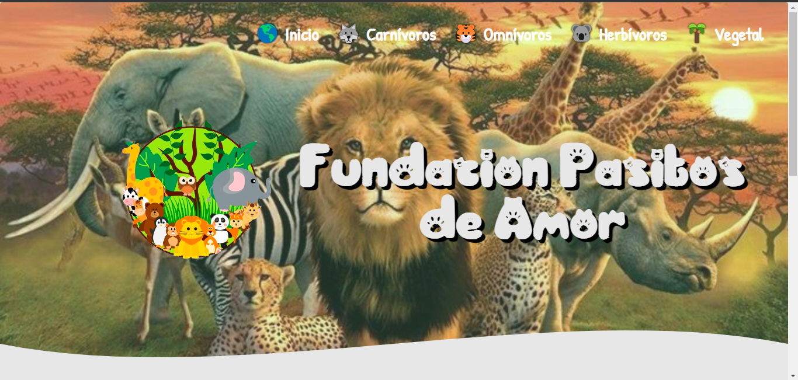
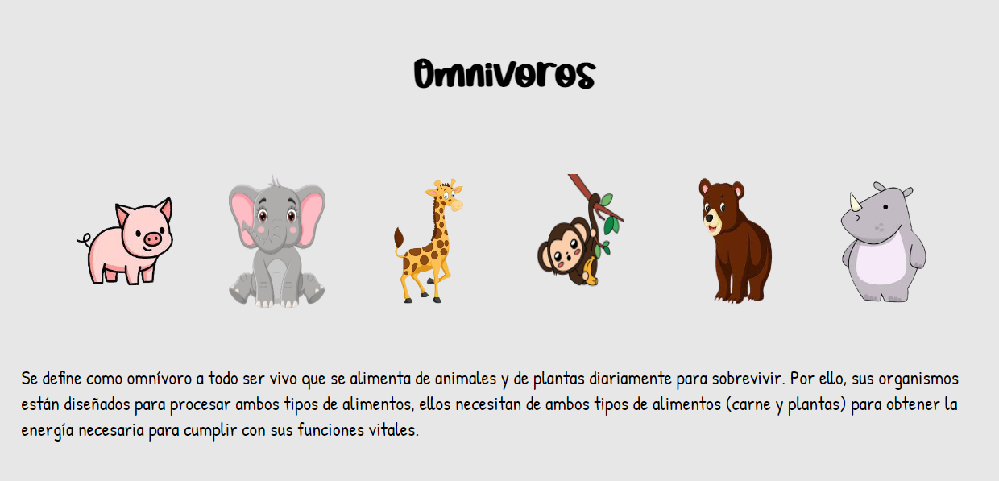
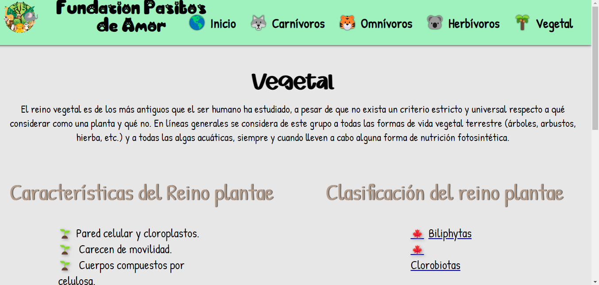

<h1 align="center"> Ejercicios Html-CSS</h1>
Ejercicio Final de HTML Y CSS, pagina dinamica de animales

 

 

 

## Construido con 🛠️

_Herramientas Utilizadas_

* [Html-Css]

## Autores ✒️
* **Laura Romero** - *Trabajo Inicial* - [KarenVargas](https://github.com/LauraRomero2704)
* **Karen Vargas** - *Trabajo Inicial* - [KarenVargas](https://github.com/Karen11Vargas)

